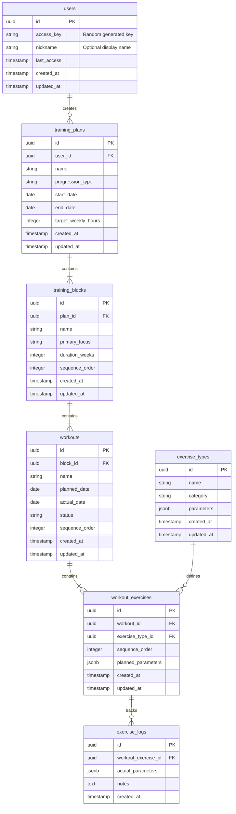

# Training System ERD

```mermaid
erDiagram
    users ||--o{ training_plans : creates
    training_plans ||--|{ training_blocks : contains
    training_blocks ||--|{ workouts : contains
    workouts ||--|{ workout_exercises : contains
    exercise_types ||--o{ workout_exercises : defines
    workout_exercises ||--o{ exercise_logs : tracks

    users {
        uuid id PK
        string access_key "Random generated key"
        string nickname "Optional display name"
        timestamp last_access
        timestamp created_at
        timestamp updated_at
    }

    training_plans {
        uuid id PK
        uuid user_id FK
        string name
        string progression_type
        date start_date
        date end_date
        integer target_weekly_hours
        timestamp created_at
        timestamp updated_at
    }

    training_blocks {
        uuid id PK
        uuid plan_id FK
        string name
        string primary_focus
        integer duration_weeks
        integer sequence_order
        timestamp created_at
        timestamp updated_at
    }

    workouts {
        uuid id PK
        uuid block_id FK
        string name
        date planned_date
        date actual_date
        string status
        integer sequence_order
        timestamp created_at
        timestamp updated_at
    }

    exercise_types {
        uuid id PK
        string name
        string category
        jsonb parameters
        timestamp created_at
        timestamp updated_at
    }

    workout_exercises {
        uuid id PK
        uuid workout_id FK
        uuid exercise_type_id FK
        integer sequence_order
        jsonb planned_parameters
        timestamp created_at
        timestamp updated_at
    }

    exercise_logs {
        uuid id PK
        uuid workout_exercise_id FK
        jsonb actual_parameters
        text notes
        timestamp created_at
    }
``` 